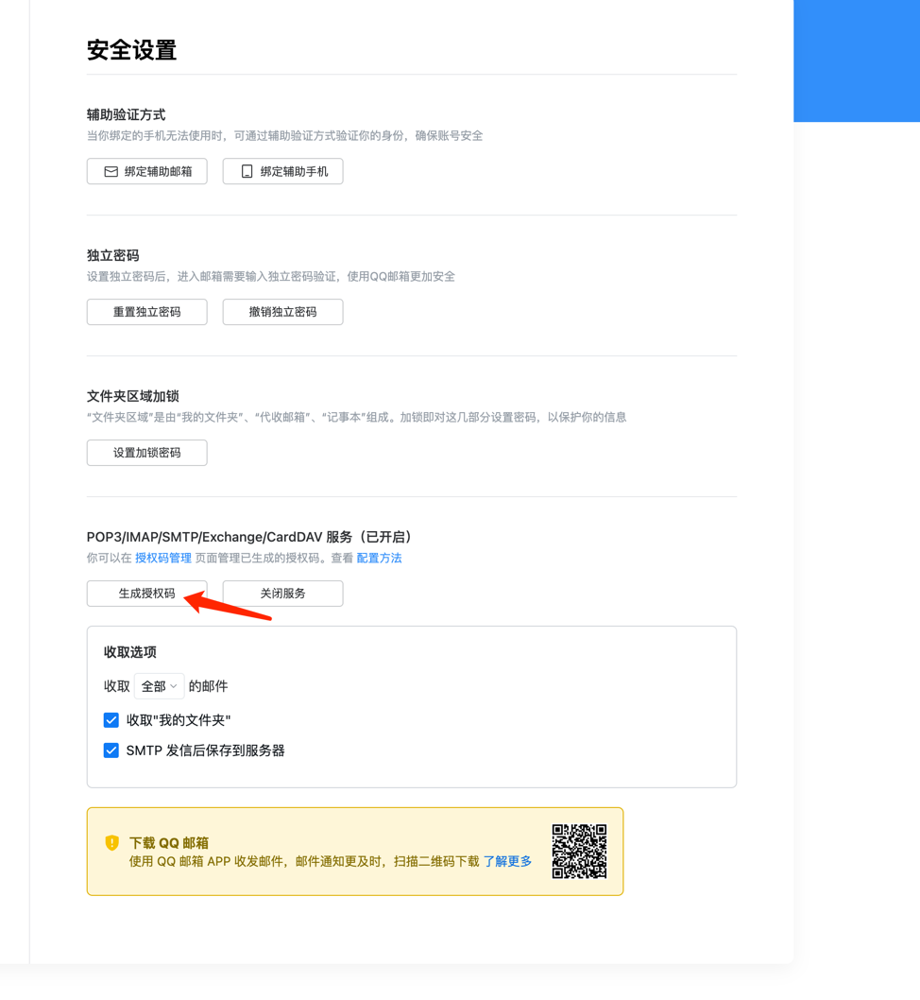

<p align="center">
  
</p>


# MessToEmail

MessToEmail 是一款 macOS 平台自动提取短信验证码发送到邮箱的的软件，百分百由Rust开发，适用于任何APP。

## 使用方法

MessToEmail 是一个没有 GUI 的菜单栏软件，第一次启动时 MessToEmail 会弹窗引导用户授权完全磁盘访问权限；授予权限后重新打开软件可在菜单栏看到 MessToEmail 的图标，点击图标列出菜单：
- 暂时隐藏：暂时隐藏图标，应用重启时图标重现，适合不经常重启 Mac 的用户
- 永久隐藏：永久隐藏图标，应用重启也不会再显示图标，适合经常重启 Mac 的用户，若需重新显示图标，需要删除 `~/.config/messtoemail/messtoemail.json` 文件，并重启应用
- 登录时启动：开机即启动
- 配置：点击后将打开json格式的配置文件。
- 日志文件：首次使用会在`~/.config/messtoemail/messtoemail.log`生成文件，如发送失败等可优先查看此信息。
- 配置文件内容如下： 首次使用会生成配置文件，需要填入发件人、收件人、邮箱授权码信息。


```
{
  "sender":"xxxxx@qq.com", 发件人
  "recipient":"xxxxxx@qq.com",收件人 
  "emailauthcode":"xxxxxxx", 邮箱授权码
  "hide_icon_forever":false,  永远隐藏图标
  "launch_at_login":false  登录时启动
}
```
邮箱授权码获取
<p align="center">

</p>
<p align="center">

</p>

⚠️注意，ARM64 版本打开时会提示文件损坏，因其需要 Apple 开发者签名才可以正常启动，作者没有 Apple 开发者证书，不过你仍然可以通过一条命令解决问题：
- 移动 MessAuto.app 到 `/Applications` 文件夹下
- 终端执行`xattr -cr /Applications/MessToEmail.app`

## 开发初衷

macOS 平台可以方便地接收来自 iPhone 的短信，由于不经常带苹果手机出门，但有时需要接受验证码或者一些其他短信，开发了这个 APP。此 APP 基于[LeeeSe/MessAuto](https://github.com/LeeeSe/MessAuto)师傅开发修改而来，在此感谢🙏。
由于本次未接触过 Rust 语言，且此 APP 能满足本人的需求，这是首次版本，也可能是最后的版本。

## 要求

- 使用 **macOS系统** （作者是 M4 macOS Sequoia 15.3.1，其他自行测试），并可以接收 **iPhone** 的短信
- 完全磁盘访问权限（为了访问位于 `～/Library` 下的 `Message.app` 的 `chat.db` 文件，以获取最新的短信）


## 自行编译

- `git clone https://github.com/LeeeSe/MessAuto.git`
- `cd MessToEmail`
- `cargo install cargo-bundle`
- `cargo bundle --release`


## 感谢

* 感谢 [@LeeSe](https://github.com/LeeeSe/) 
* 感谢 [@尚善若拙](https://sspai.com/post/73072) 提供获取短信思路